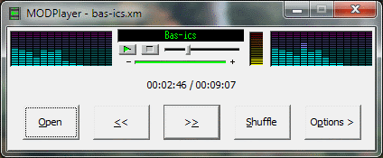

# MODPlayer
  
Tracker Music player using MOD Plugin.
Plays module music (mod, s3m, xm, it) using the MOD Plugin MOD Playback Engine.
What you need to compile and use this code:
Visual C++ Express 2010 or better.
ModPlugin DLL (*IN THE APPLICATION OR THE WINDOWS\SYSTEM[32] FOLDER*).
You can get the modplugin DLL from https://www.castlex.com/.
However, you will not get the import library and the header files. Those are mine!
Creating the header file was easy but the import library was a pain.
The ModPlugin DLL uses the fastcall calling convention but uses cdecl naming convention (doh).
So finally I created an import library using function ordinals.
You can also dynamically load the DLL. But I always like load time linkage (don't ask me why).
As usual, I do not accept responsibility for any effects, adverse or otherwise, that this code may have on you, your computer, your sanity, your dog, and anything else that you can think of. Use it at your own risk. Have fun.
